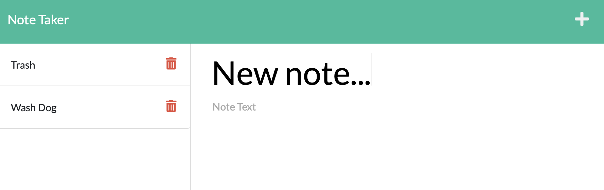

# Note-Taker

### [Project URL](https://aqueous-beach-11734.herokuapp.com/notes) 

## Table of Contents
- [Project Description](#description)
- [Installation Instructions](#installation)
- [Usage Instructions](#usage)
- [Contributing Resources](#contribution)
- [Testing Methods](#test)
- [GitHub User Name](#gitHub)
- [Email Address](#email)

## Project Description
- Application to Write and Save Notes to a json Database.

## Installation Instructions
- None.

## Usage Instructions
- Start the server if not running with node server.js. Otherwise simply follow the URL above, click Get Started, enter a Note Title and Note Text, and click the save button icon.  Click the '+' icon for a new note or click your old notes on the left-hand column to check them again. 

## Contributing Resources
- HTML, CSS, JavaScript, Bootstrap, Node.js, Express, UUID, Heroku.

## Testing Methods
- Visual Studio Code, Heroku.

## GitHub User Name
- jWeibelbootcamp

## Email Address
- weibel.jason@gmail.com

## Licensing 
- MIT
